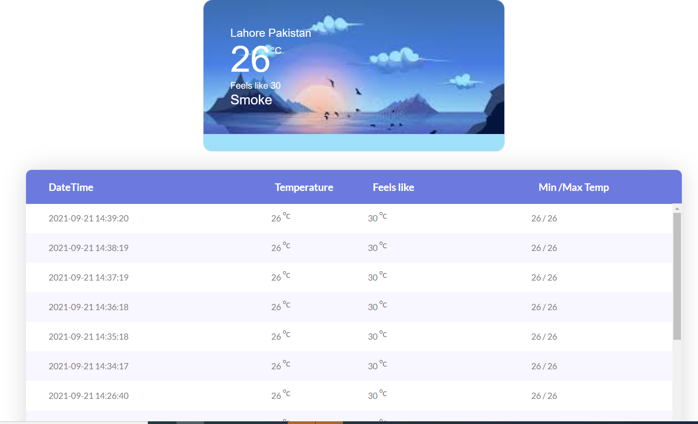
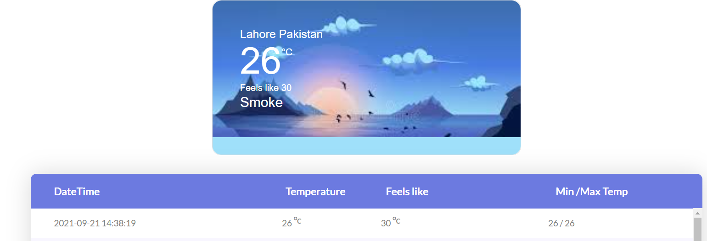

<!-- PROJECT LOGO -->
<br />
<p align="center">
  <a href="https://github.com/naumanz/weather-information">
    
  </a>

<h3 align="center">Weather information with Apache Camel & Spring Boot</h3>
</p>


<!-- TABLE OF CONTENTS -->
<details open="open">
  <summary>Table of Contents</summary>
  <ol>
    <li>
      <a href="#about-the-project">About The Project</a>
      <ul>
        <li><a href="#built-with">Built With</a></li>
      </ul>
    </li>
    <li>
      <a href="#getting-started">Getting Started</a>
      <ul>
        <li><a href="#prerequisites">Prerequisites</a></li>
        <li><a href="#installation">Installation</a></li>
      </ul>
    </li>
    <li><a href="#usage">Usage</a></li>
    <li><a href="#contact">Contact</a></li>
  </ol>
</details>


<!-- ABOUT THE PROJECT -->
## About The Project

<a href="https://github.com/naumanz/weather-information">
    
</a>

Spring Boot application which gathers the weather information of a city and serve in a webpage lively.
This application will serve the current temperature of the city in Celsius inside
a web page. 
* Web page will refresh automatically after 10 sec and display the last read temperature if available.
* Web page will display temperature after every interval of 1 min which is configured in backend.


### Built With

Application is build by using the following technologies

* [Spring-boot](https://spring.io/projects/spring-boot)
* [Apache-Camel](https://camel.apache.org/)
* [H2-Database](https://www.h2database.com/html/main.html)
* [Angular](https://angular.io/)


<!-- GETTING STARTED -->
## Getting Started

A project can be setup by two ways.
1. To clone the project from github to local.
2. Download the image from docker-hub and run the image.

### Prerequisites

* Java 8 environment must be setup properly to use the application.
* Application allow to download the dependencies from maven.
* Latest maven must be installed.
* Optional: Docker setup if you want to run the application with docker image

### Installation (GitHub)

1. Clone the repo to local
   ```sh
   git clone https://github.com/naumanz/weather-information.git
   ```
2. Run command in root directory of project
   ```mvn
   mvn clean package
   ```
3. After successfully build the project 
   * Go to the backend project target folder (weather-information\backend\target).
   * Open command terminal in target folder.
   * Run below command to run the application.
   
   ```command
   java -jar weather-information-v1.jar;
   ```
   * Default read period is 1 minute, After every one minute get the new weather details and store into the database.
    you can override this value. i.e in every 5 minutes.

   ```command
      java -jar weather-information-v1.jar --openweathermap.delay=5;
      ```

### Installation (Docker-hub)

1. You can download and run the docker-image of project
   * pull the image with name
   ```sh
   docker pull naumanz187/weather-information-image
   ```
   * run the image with name
   ```sh
   docker run -p 8080:8080 naumanz187/weather-information-image
   ```

Note: please run the image only in 8080 port as backend api exposed only in 8080 port.

<!-- USAGE EXAMPLES -->
## Usage

After successfully initiated the backend project, you can access the web page to enter the url http://localhost:8080.
It will display the landing page with only current weather details of City:Lahore and Country:Pakistan as Application only getting the information of that city.
You can configure and get the details of any city.

<a href="https://github.com/naumanz/weather-information">
    
</a>


<!-- CONTACT -->
## Contact

Nauman Zafar - [@LinkedIn](https://www.linkedin.com/in/nauman-zafar-7a6877114) - naumanzafar187@gmail.com

Project Link: [https://github.com/naumanz/weather-information.git](https://github.com/naumanz/weather-information.git)


